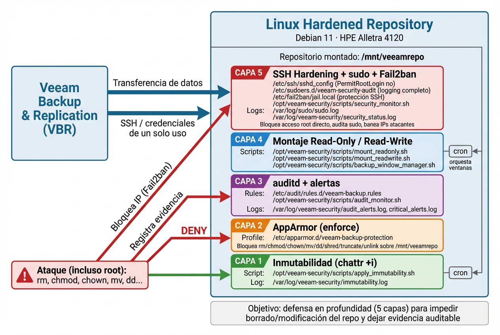

# Linux Hardened Repository for Veeam Backup & Replication

[](https://github.com/yourusername/veeam-hardened-repository)
[](https://github.com/yourusername/veeam-hardened-repository)
[](https://github.com/yourusername/veeam-hardened-repository)
[](https://github.com/yourusername/veeam-hardened-repository)

> Enterprise-grade hardened backup repository implementation with multi-layered security architecture for ransomware protection and immutable backup storage.

##  Table of Contents

- [Architecture]
- [Documentation]

##  Overview

This project documents the design, implementation, and hardening of an enterprise backup repository on HPE Alletra 4120 infrastructure, integrated with Veeam Backup & Replication. The solution implements a **5-layer defense-in-depth security model** to protect against ransomware attacks, unauthorized access, and data tampering.

**Business Objective:** Ensure backup integrity and availability through immutable storage and comprehensive security controls, preventing unauthorized deletion or modification of backup data while maintaining auditable evidence of all repository operations.

##  Architecture



The repository implements a layered security approach:

### Infrastructure Layer
- **Server:** HPE Alletra 4120
- **Operating System:** Debian 11 (hardened configuration)
- **Storage:** RAID 6+0 configuration with 8 physical disks
- **Network:** Isolated backup network segment with firewall rules

### Security Model: Defense in Depth (5 Layers)

```
┌─────────────────────────────────────────────────────────────────┐
│                    LAYER 5: SSH Hardening                       │
│  PermitRootLogin=no | Key-based Auth | Fail2ban | sudo logging  │
├─────────────────────────────────────────────────────────────────┤
│              LAYER 4: Read-Only/Read-Write Toggle               │
│     Automated mount point management | Backup window control    │
├─────────────────────────────────────────────────────────────────┤
│                  LAYER 3: Audit & Alerting                      │
│        auditd rules | Monitoring scripts | Alert logging        │
├─────────────────────────────────────────────────────────────────┤
│              LAYER 2: AppArmor Enforcement                      │
│   Prevents rm/chmod/chown/mv/dd/shred/truncate on /mnt/veeamrepo│
├─────────────────────────────────────────────────────────────────┤
│              LAYER 1: Immutability (chattr +i)                  │
│         File-level immutability | Automated enforcement         │
└─────────────────────────────────────────────────────────────────┘
```

##  Security Layers

### Layer 1: Immutability
- **Technology:** `chattr +i` attribute on backup files
- **Purpose:** Prevents file deletion or modification at the filesystem level
- **Automation:** Cron job applies immutability automatically
- **Log:** `/var/log/veeam-security/immutability.log`

### Layer 2: AppArmor Enforcement
- **Profile:** `/etc/apparmor.d/veeam-backup-protection`
- **Blocked Commands:** `rm`, `chmod`, `chown`, `mv`, `dd`, `shred`, `truncate`, `unlink`
- **Scope:** Repository mount point `/mnt/veeamrepo`
- **Purpose:** Prevents malicious commands from executing against backup data

### Layer 3: Audit & Alerting
- **Technology:** `auditd` + custom monitoring scripts
- **Rules:** `/etc/audit/rules.d/veeam-backup.rules`
- **Monitoring Script:** `/opt/veeam-security/scripts/audit_monitor.sh`
- **Logs:** 
  - `/var/log/veeam-security/audit_alerts.log`
  - `/var/log/veeam-security/critical_alerts.log`

### Layer 4: Read-Only/Read-Write Toggle
- **Mount Management:** Dynamic remount based on backup windows
- **Scripts:**
  - `/opt/veeam-security/scripts/mount_readonly.sh`
  - `/opt/veeam-security/scripts/mount_readwrite.sh`
  - `/opt/veeam-security/scripts/backup_window_manager.sh`
- **Automation:** Cron-based scheduling for backup windows

### Layer 5: SSH Hardening
- **Configuration:** `/etc/ssh/sshd_config`
  - Root login disabled (`PermitRootLogin no`)
  - Key-based authentication only
  - Fail2ban protection against brute force
- **Sudo Logging:** Complete audit trail in `/etc/sudoers.d/veeam-security-audit`
- **Security Monitoring:** `/opt/veeam-security/scripts/security_monitor.sh`
- **Status Log:** `/var/log/veeam-security/security_status.log`

##  Features

-  **Immutable Backup Storage** - Ransomware-proof repository with file-level immutability
-  **Multi-Layer Security** - 5 independent security layers for comprehensive protection
-  **Automated Compliance** - Scheduled enforcement of security policies via cron
-  **Real-time Monitoring** - Continuous audit logging and alerting for suspicious activities
-  **Access Control** - Least-privilege model with single-use credentials
-  **Network Isolation** - Dedicated backup network segment with firewall rules
-  **Evidence Trail** - Complete audit logs for compliance and forensics
-  **Fail2ban Integration** - Automated IP blocking for attack mitigation

## Technical Specifications

### Hardware
| Component   | Specification                        |
| ----------- | ------------------------------------ |
| **Server**  | HPE Alletra 4120                     |
| **CPU**     | Enterprise-grade processor           |
| **RAM**     | 16 GB minimum                        |
| **Storage** | RAID 6+0 (8 physical disks)          |
| **Network** | 1 Gbps minimum, isolated backup VLAN |

### Software Stack
| Layer                | Technology                            |
| -------------------- | ------------------------------------- |
| **Operating System** | Debian 11 (Bullseye)                  |
| **Backup Software**  | Veeam Backup & Replication            |
| **Security**         | AppArmor, auditd, Fail2ban            |
| **Firewall**         | ufw (Uncomplicated Firewall)          |
| **Access**           | OpenSSH (hardened configuration)      |
| **Monitoring**       | Custom bash scripts + cron automation |

### Network Configuration
- **SSH Port:** 22 (restricted to Veeam server IP)
- **Veeam Data Ports:** TCP 2500-5000
- **Firewall Policy:** Default DENY, explicit ALLOW for required services
- **IP Blocking:** Automated via Fail2ban

##  Installation

### Prerequisites
```bash
# Update system
sudo apt update && sudo apt upgrade -y

# Install required packages
sudo apt install -y openssh-server sudo fail2ban apparmor-utils auditd
```

### Quick Start
```bash
# Clone repository
git clone https://github.com/PabloGarzonB0/Networks-Core/tree/main/11_IT_Support_Redes
cd veeam-hardened-repository

# Review installation guide
cat docs/PA-CSG-3_2_MAN-1_-_Debian_Installation.md

# Review configuration guide
cat docs/PA-CSG-3_2_MAN-1_-_Service_Configuration_Manual.md
```

##  Documentation

This repository includes comprehensive technical documentation:

### Installation Guides
- **[Debian Installation Manual](./Documentation/PA-CSG-3_2_MAN-1_-_Service_Configuration_Manual.pdf)** - Complete OS deployment on HPE Alletra 4120
  - RAID configuration procedures
  - iLO console management
  - Network configuration
  - System hardening steps

### Configuration Guides
- **[Service Configuration Manual](./Documentation/PA-CSG-3.2.MAN-1%20-%20Configuracion%20de%20Veeam%20Backup%20para%20Repositorio%20Inmutable.pdf)** - Repository setup and security implementation
  - Veeam integration procedures
  - Security layer configuration
  - Firewall rules and network topology
  - Monitoring and alerting setup

### Architecture Diagrams
- **[Security Architecture](./Netwrk_Architecture.png)** - Visual representation of 5-layer security model

##  Project Outcomes

### Business Impact
-  **Zero Data Loss:** Immutable backups prevent ransomware encryption/deletion
-  **Enhanced Security Posture:** Multi-layer defense reduces attack surface
-  **Compliance Ready:** Complete audit trail for regulatory requirements
-  **Automated Operations:** Reduced manual intervention through scripting

### Technical Achievements
- Implemented enterprise-grade backup infrastructure from scratch
- Configured RAID storage with redundancy and performance optimization
- Developed custom security automation scripts for continuous enforcement
- Integrated monitoring and alerting for proactive threat detection
- Documented complete deployment process for knowledge transfer

### Topics
- **Infrastructure Engineering:** Server provisioning, RAID configuration, system hardening
- **Network Security:** Firewall configuration, network segmentation, SSH hardening
- **Linux Administration:** Debian deployment, service management, automation
- **Security Implementation:** AppArmor, auditd, Fail2ban, immutability controls
- **Documentation:** Technical writing, architecture diagrams, standard operating procedures
- **Backup & Recovery:** Veeam integration, repository management, retention policies

---

##  Contributing

This is a professional portfolio project documenting enterprise infrastructure implementation. While not open for direct contributions, feel free to use this as a reference for your own hardened repository deployments.

##  License

This documentation is provided for educational and portfolio purposes.

---

<div align="center">

**Built with** 🔒 **security-first mindset** | **Documented for** 📚 **knowledge sharing**

*Part of enterprise telecommunications infrastructure operations*

</div>
